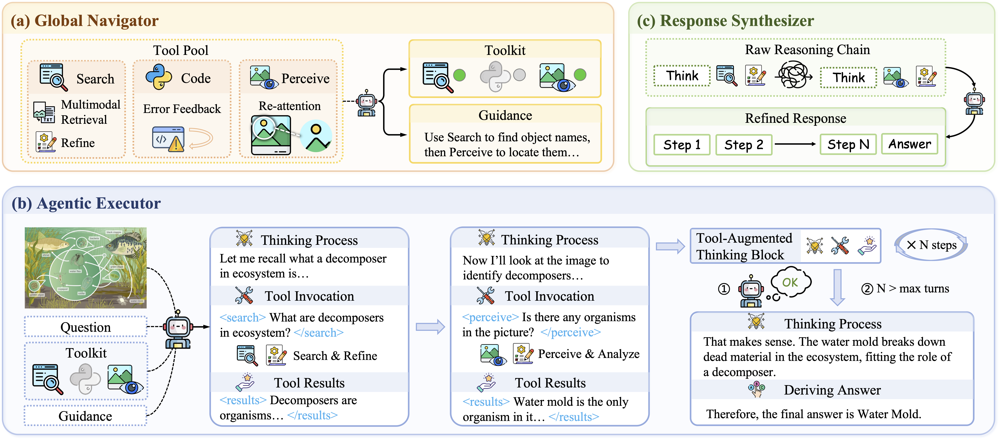
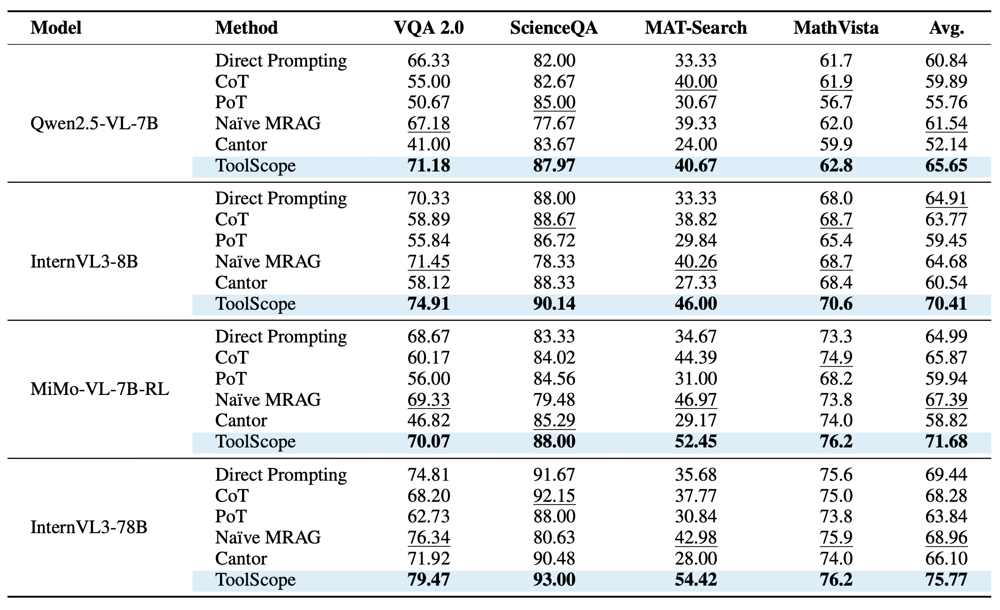

# 🛠️ ToolScope  
## An Agentic Framework for Vision-Guided and Long-Horizon Tool Use  

ToolScope is a training-free, modular framework for tool-augmented multimodal reasoning. It unifies global planning with local multimodal perception to solve complex visual question answering (VQA) tasks, mitigating visual context degradation and enabling adaptive tool use across diverse datasets. The system supports multiple LMM backends via vLLM and integrates specialized tools for retrieval, dynamic perception, and code execution.  


### 📚 Table of Contents  
- [🛠️ ToolScope](#️-toolscope)
  - [An Agentic Framework for Vision-Guided and Long-Horizon Tool Use](#an-agentic-framework-for-vision-guided-and-long-horizon-tool-use)
    - [📚 Table of Contents](#-table-of-contents)
  - [Overview](#overview)
  - [Key Features](#key-features)
  - [Experimental Results](#experimental-results)
  - [Quickstart](#quickstart)
  - [Acknowledgments](#acknowledgments)


## Overview  
ToolScope structures inference into three coordinated, modular phases:  

1. **Global Navigator**  
   Performs high-level task decomposition and tool selection (from Search/Code/Perceive), providing strategic guidance to avoid redundant tool calls.  

2. **Agentic Executor**  
   Executes iterative, tool-augmented reasoning. Dynamically invokes tools to resolve subproblems, with a dedicated Perceive tool for re-attending to visual details.  

3. **Response Synthesizer**  
   Condenses reasoning trajectories, filters noise, and formats final answers for evaluation (concise text/numerical values/options).  



## Key Features  
- **Visual Context Preservation**: Dedicated Perceive tool mitigates visual context degradation in long-horizon reasoning. 
- - **Modular Toolkit**: Integrates Search (external knowledge), Code (numerical/logical computation), and Perceive (dynamic visual grounding).  
- - **Training-Free & Plug-and-Play**: No task-specific fine-tuning; works with off-the-shelf multimodal LLMs.   
- **Multi-Backend Compatibility**: Supports Qwen2.5-VL, InternVL3, MiMo-VL series; maintains performance gains across model sizes.  
- **Broad Dataset Support**: Compatible with VQA 2.0, ScienceQA, MAT-Search, and MathVista (covers general/ scientific/retrieval/mathematical VQA tasks).  


## Experimental Results
ToolScope delivers consistent and significant performance gains across 4 diverse VQA benchmarks (VQA 2.0, ScienceQA, MAT-Search, MathVista) and 3 major LMM backends (Qwen2.5-VL, InternVL3, MiMo-VL), outperforming all prompt-based (Direct Prompting/CoT/PoT) and tool-augmented (Naïve MRAG/Cantor) baselines.  

Key highlights:  
- **Average Performance Gain**: Up to +6.69% (MiMo-VL-7B-RL), with consistent improvements across all backends (+4.81% to +6.33%).  
- **Task-Specific Breakthroughs**: Peak gain of +9.12% on MAT-Search (retrieval-heavy tasks), +4.67% on ScienceQA (scientific reasoning), and stable gains on general VQA (VQA 2.0) and mathematical reasoning (MathVista).  
- **Cross-Model Robustness**: Maintains superior performance across model sizes (from 7B to 78B) and architectures, with no task-specific fine-tuning.  




## Quickstart  
Run end-to-end inference with your preferred model and dataset. The `model_path` can point to a local directory or Hugging Face Hub ID (supported by vLLM).  
 
```bash
python -m src.run \
  --data_dir /path/to/the/dataset  # Path to your dataset directory  
  --dataset_name ScienceQA       # Supported: VQAv2/ScienceQA/MAT/MathVista  
  --split testvqa                # Dataset split (e.g., train/val/test/testmini)  
  --model_path OpenGVLab/InternVL3-8B  # LMM backend (local path or HuggingFace ID)  
  --retriever_cache_path bm25.pkl  # textual retriever cache
  --text_corpus_path /path/to/text/corpus # path to your text corpus
  --mm_retriever_path ViT-B/16  # multimodal retriever
```  


## Acknowledgments  
ToolScope builds on open-source projects and datasets:  
- Inference engine: [vLLM](https://github.com/vllm-project/vllm) and [Hugging Face Transformers](https://github.com/huggingface/transformers)  
- Retrieval & Perception: [CLIP](https://github.com/openai/clip) (cross-modal) and [bm25s](https://github.com/xhluca/bm25s) (sparse retrieval)  
- Datasets: [VQA 2.0](https://visualqa.org/), [ScienceQA](https://scienceqa.github.io/), [MAT-Search](https://github.com/Liuziyu77/Visual-RFT), [MathVista](https://mathvista.github.io/)  
